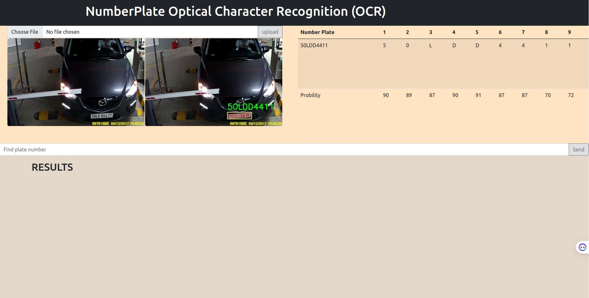
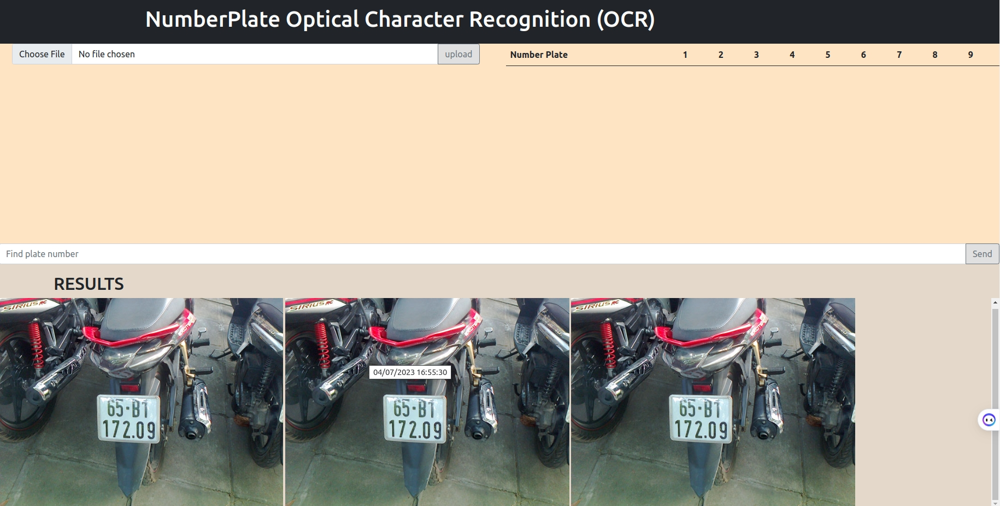
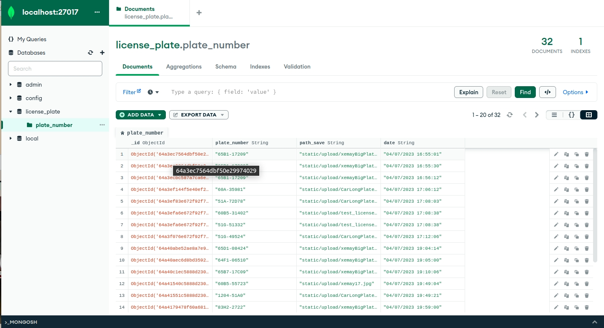

# License Plate Recognition
Đây là một project xây dựng một web nhận dạng biển số, gồm 2 chức năng:<br>

* Nhận dạng biển số xe (Dùng yolov8 cho cả 2 task là detection và recognition, sử dụng thư viện albumentation để quay ảnh ngẫu nhiên theo phân phối chuẩn trong khoảng -45 độ đến 45 độ), lưu kết quả vào database
* Tìm kiếm ảnh biển số xe trong database theo chuỗi chữ số của biển

# Cách sử dụng

## Cách 1: Download project và cài đặt

### Cài đặt môi trường
```
pip install -r requirements.txt
```
Ngoài ra, mongodb cũng cần được cài trên máy (Đã được bật, đường kết nối là "mongodb://localhost:27017")

### Khởi động web

Chạy câu lệnh sau:
```
python -m flask run
```
Sau khi chạy, bật link http://127.0.0.1:5000 để tương tác với web 

Chú ý: biển 2 dòng sẽ được định dạng là "A-B" (A là dòng trên, B là dòng dưới), còn biển 1 dòng sẽ được định dạng thành 1 chuỗi liên tục "ABCDS..."

## Cách 2: Sử dụng Docker

### Tải các image từ Dockerhub
* Tải docker
* Đăng nhập bằng tài khoản Docker Hub
* Pull 2 image sau: hasybach1103/lp_recognition_web và hasybach1103/lp_recognition_database bằng lệnh:
```
docker pull hasybach1103/lp_recognition_web
docker pull hasybach1103/lp_recognition_database
```

### Tạo file docker-compose.yml

```
version: '3.9'
services:
  mongo_db:
    image: hasybach1103/lp_recognition_database
    ports:
      - "27017:27017"
    restart: always
    volumes:
      - ./mongo_data:/data/db
      - ./init-mongo.js:/docker-entrypoint-initdb.d/init-mongo.js:ro
  web:
    image: hasybach1103/lp_recognition_web
    ports:
      - "8080:8080"
    depends_on: 
      - mongo_db
```
### Tạo container chứa web
```
docker compose -f docker-compose.yml up
```

Cuối cùng, ta đi đến địa chỉ http://127.0.0.1:8080

# Results

   <p align="center" >
   
    Chức năng nhận diện biển số
</p>

   <p align="center" >
   
    Chức năng tìm kiếm biển số
</p>

   <p align="center" >
   
    Database
</p>

## Nhận xét
* Mô hình nhận dạng đúng và chuẩn với những ảnh trong bãi và ngoài trời, một số ảnh bị nghiêng một chút vẫn có thể nhận dạng đúng
* Tuy nhiên, với một số ảnh bị quá nghiêng, mô hình hay bị nhầm lẫn các kí tự, ví dụ như 1 với 7, 0 với D, X với K
* Đối với các loại biển số xe khác loại biển số xe thường: Chỉ nhận diện được biển số chứ không nhận dạng các kí tự của biển số xe đó (Với task detection, mô hình được huấn luyện với bộ dữ liệu bao gồm cả biển số xe thường, biển số xe quân đội, ... nhưng với task recognition, chỉ có dữ liệu của biển số xe thường)

## Hướng cải thiện project
* Thêm chức năng để có thể nhận diện từ ảnh lấy trực tiếp từ camera
* Thêm chức năng xóa các dữ liệu đã cũ 
* Tìm hiểu cách đóng gói với docker
